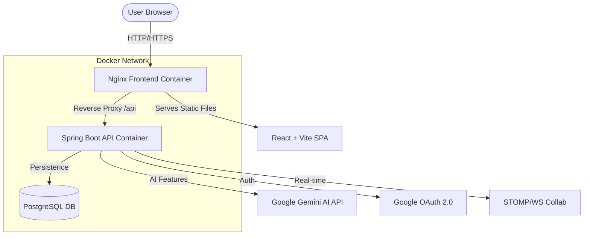

# 🌍 TravelLoop — Smart AI Travel Planner

TravelLoop is a production-grade, full-stack travel planning platform designed to simplify trip organization using AI. It features intelligent itinerary generation, real-time collaboration, and integrated budget tracking.

---

## 🏗️ Architecture Overview

TravelLoop follows a modern microservices-lite architecture containerized with Docker.



---

## ✨ Key Features

- **🤖 AI Smart Planner**: Generate complete day-by-day itineraries with a single prompt.
- **🤝 Live Collaboration**: Sync trips with friends in real-time using WebSockets.
- **💰 Budget Management**: Track expenses with category-wise breakdowns and charts.
- **🔐 Secure Auth**: Seamless login via Google OAuth 2.0 or standard credentials.
- **📱 PWA Ready**: Install TravelLoop on your mobile device for offline access.
- **🗺️ Interactive Maps**: Visualize your stops and route progress (Coming soon).

---

## 🗄️ Database Schema

The system uses PostgreSQL with the following core entities:

| Table | Description |
|-------|-------------|
| `users` | User profiles, auth details, and roles. |
| `trips` | Trip metadata, dates, destination, and budget. |
| `trip_stops` | Individual locations/activities within a trip. |
| `budgets` | Expense tracking linked to specific trips. |
| `collaborators` | Mapping of users shared on a trip. |

---

## � Authentication

TravelLoop supports two authentication methods:
- **Email/Password**: Traditional email-based registration and login
- **Google OAuth 2.0**: One-click sign-in with Google account

Both methods are configured with sensible defaults. For local development setup and troubleshooting, see [AUTH_SETUP.md](AUTH_SETUP.md).

For testing authentication locally, refer to [TESTING_AUTH.md](TESTING_AUTH.md).

---

## �🚀 Getting Started (Docker)

### 1. Prerequisites
- Docker & Docker Compose installed.
- A **Google Gemini API Key** (Get it from [Google AI Studio](https://aistudio.google.com/)).
- A **Google OAuth Client ID** (Already configured in `.env`, but can be overridden).

### 2. Environment Setup
Create a `.env` file in the root directory:
```env
GEMINI_API_KEY=your_gemini_api_key_here
GOOGLE_CLIENT_ID=339374223627-lptj3pivl7ql3saliv7prlr8n67ce9g7.apps.googleusercontent.com
```

### 3. Run the App
From the root directory, run:
```bash
docker-compose up --build
```

### 4. Access the Platform
- **Frontend**: `http://localhost:5173`
- **Backend API**: `http://localhost:8080/swagger-ui.html`
- **Database**: `localhost:5433`

---

## 🛠️ Tech Stack

- **Frontend**: React 18, Vite, Tailwind CSS, Framer Motion, TanStack Query.
- **Backend**: Java 17, Spring Boot 3.2, Spring Security, Spring AI.
- **Database**: PostgreSQL 16.
- **Infrastructure**: Docker, Nginx.

---

## 📄 License
MIT License. Created with ❤️ for travelers.
